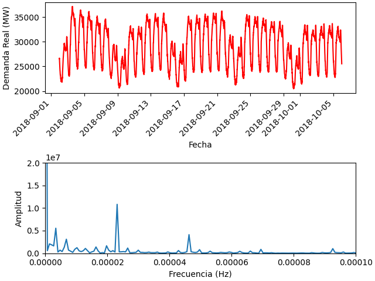

# demanda-real
El proyecto descarga datos de la API de la red eléctrica española y los grafica. Se realiza un análisis frecuencial y lo grafica también.

# Instrucciones
Para utilizar el proyecto se debe obtener un token para la API de E-sios de la red eléctrica española. Se puede obtener en: https://api.esios.ree.es/
Este token debe guardarse en un archivo llamado `config.py` en la raíz del proyecto. Se debe guardar el token como un string llamado api_token. Ejemplo: `api_token = "sdfkjewrkamrkcmsfkl"`

Para ejecutar el proyecto en las mismas condiciones en las que ha sido realizado, se proporciona el archivo `requirements.txt` que puede ser cargado creando un entorno virtual con venv. Puedes ver cómo crear un entorno virtual con venv en mi web: https://todoia.es/entornos-virtuales-con-python/

El programa se puede ejecutar directamente abriendo el archivo main.py con Python. Esto generará una carpeta llamada results que contendrá una imagen de la gráfica soliciatada por el ejercicio. También se mostrará la gráfica por pantalla con `matplotlib`. 

Se pueden cambiar los datos solicitados dando otros valores a las variables `id_ree`, `start_date`, y `end_date`. El resultado no siempre será el óptimo porque el código está optimizado para el ejercicio.
Si se cambian estos datos, algunas cosas que pueden salir mal son:
- Si se cambia el `id_ree` es posible que los datos devueltos por la API tengan un formato distinto y el código no funcione, habría que hacer adaptaciones
- Si se utilizan otros datos, es posible que la gráfica en el dominio frecuencial sea muy distinta. Habría que cambiar los valores que se aplican de zoom ya que los que se proporcionan en el código son pensados específicamente para los datos del ejercicio.

# Estructura del código
El código consta de varias funciones:
- `_save_data_json` función auxiliar utilizada para guardar en local los datos en formato JSON descargados de la API.
- `get_indicator` función que se encarga de descargar los datos originales de la API de REE
- `freq_analysis` función que se encarga de convertir los datos descargados en dominio temporal a dominio frecuencial
- `generate_plots` función que a partir de los datos de los dominios temporal y frecuencial, genera una gráfica comparandolos según solicitado por el ejercicio

# Resultado
El resultado de graficar los datos solicitados (Demanda Real) para el periodo de tiempo del 02/09/2018 al 06/10/2018 es el siguiente:

